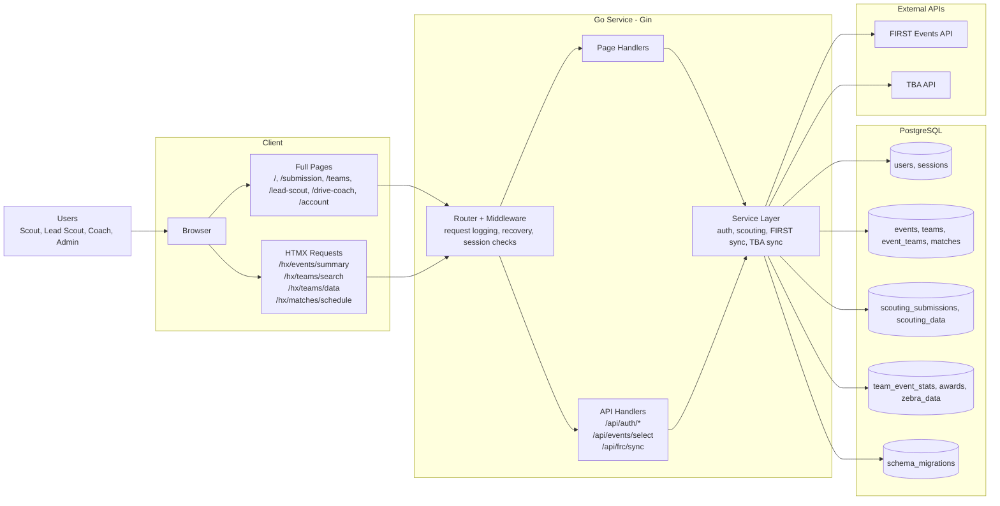

# TealTeam UI Communication Flow

This diagram focuses on how browser interactions move through the Gin server, data layer, and external APIs.



## Runtime Bootstrap

```text
cmd/web/main.go
  -> resolve env mode and DATABASE_URL
  -> db.Connect()
  -> ApplyMigrations(migrations/)
  -> SyncOnBoot() unless FIRST_SYNC_ON_BOOT=false
  -> Start TeamStatsSyncer() when TBA_AUTH_KEY is set
  -> serve routes
```

## Notes

- Full pages return complete HTML with layout.
- HTMX routes return partial HTML fragments.
- `POST /api/frc/sync` exists and is available to admin or lead scout sessions.
- Background TBA sync runs at two cadences:
  - 2 minutes during active event windows
  - 3 hours between events
- Migrations are tracked in `schema_migrations`.
