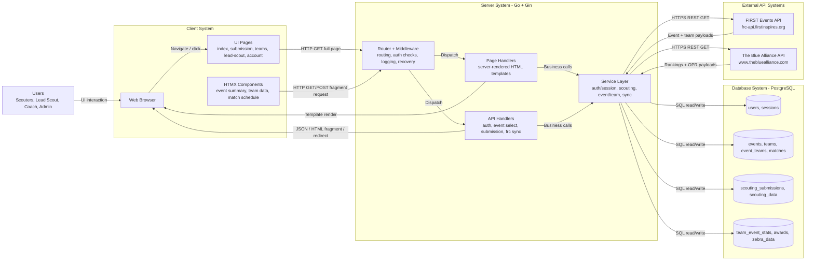

# TealTeam UI Communication Flow Chart

This chart emphasizes how the UI communicates with the server, database, and external APIs.



## ASCII Box Diagram (Fallback)

```
┌─────────────────────────────────────────────────────────────────────────────┐
│                            CLIENT SYSTEM                                     │
│  ┌──────────────┐  ┌────────────────┐  ┌──────────────────────────────────┐ │
│  │ Web Browser  │→→│   UI Pages     │→→│  HTMX Components                 │ │
│  │              │  │ (full renders) │  │  (partial updates)               │ │
│  └──────────────┘  └────────────────┘  └──────────────────────────────────┘ │
│         ↑                                              ↑                      │
│         │ HTTP GET/POST (full page)                   │ HTTP GET/POST        │
│         │                                             │ (fragment requests)   │
└─────────┼─────────────────────────────────────────────┼──────────────────────┘
          │                                             │
          ↓                                             ↓
┌─────────────────────────────────────────────────────────────────────────────┐
│                      SERVER SYSTEM (Go + Gin)                                │
│  ┌────────────────────────────────────────────────────────────────────────┐ │
│  │  Router + Middleware (routes, auth, logging)                           │ │
│  └──────────────────────┬────────────────────────────────────────────────┘ │
│                         │                                                   │
│         ┌───────────────┼────────────────┐                                  │
│         ↓               ↓                 ↓                                  │
│  ┌─────────────┐ ┌────────────┐  ┌──────────────┐                           │
│  │   Page      │ │   API      │  │  Service     │                           │
│  │  Handlers   │ │  Handlers  │  │  Layer       │                           │
│  │ (render)    │ │ (auth,     │  │ (business    │                           │
│  │             │ │  submit)   │  │  logic)      │                           │
│  └─────────────┘ └────────────┘  └──────────────┘                           │
│         │               │              │                                    │
│         └───────────────┼──────────────┘                                    │
│                         ↓                                                   │
│                  SQL read/write (GORM)                                      │
└─────────────────────┬─────────────────────────────────────────────────────┘
                      │
         ┌────────────┼────────────┬─────────────────┐
         ↓            ↓            ↓                 ↓
┌──────────────┐ ┌──────────┐ ┌───────────┐ ┌───────────────┐
│  DB: users,  │ │ DB:      │ │ DB:       │ │ DB: team_     │
│  sessions    │ │ events,  │ │ scouting_ │ │ event_stats,  │
│              │ │ teams    │ │ data,     │ │ awards,       │
│              │ │          │ │ scouting_ │ │ zebra_data    │
│              │ │          │ │ submissions│ │               │
└──────────────┘ └──────────┘ └───────────┘ └───────────────┘
                      ↑
         HTTPS REST GET (payload pull)
         ↓
┌────────────────────────────────┐  ┌────────────────────────────────┐
│  FIRST Events API              │  │  The Blue Alliance API         │
│  frc-api.firstinspires.org     │  │  www.thebluealliance.com       │
│                                │  │                                │
│  • Events + Teams endpoint     │  │  • OPR rankings endpoint      │
│  • Match schedule endpoint     │  │  • Team stats endpoint        │
└────────────────────────────────┘  └────────────────────────────────┘
```

## Communication Methods

- Browser -> Server: HTTP GET/POST.
- HTMX -> Server: HTTP partial updates (HTML fragment responses).
- Server -> Browser: full HTML, partial HTML, JSON, and redirects.
- Server -> PostgreSQL: SQL reads/writes through GORM.
- Server -> External APIs: HTTPS REST calls to FIRST and TBA.

## TBA API Integration

The Blue Alliance (TBA) API is a critical external data source for team statistics and match schedules. To handle TBA's season-specific response schemas:

1. **Component OPR Parsing** (internal/frc/tba_client.go)
   - TBA's `/coprs` endpoint returns dynamic component names (varies by game mechanics)
   - Solution: Parse generic map structure with preferred name matching + heuristics
   - Handles years like 2026 that changed from fixed fields to dynamic names

2. **Ranking Points Fallbacks** (internal/frc/tba_client.go)
   - Newer seasons (2026+) use `sort_orders` and `extra_stats` arrays instead of direct `qual_points`/`total_points`
   - Solution: Try direct field access first, fall back to array values if null
   - Ensures data population across all seasons

3. **Match Persistence** (cmd/scripts/comprehensive_tba_sync/main.go)
   - Matches are synced from TBA and persisted to database with upsert logic
   - Conflict resolution on `(event_id, match_number, match_type)`
   - Ensures match schedules and results are always available

For detailed troubleshooting and migration guide, see [TBA_SCHEMA_FIX_SUMMARY.md](../TBA_SCHEMA_FIX_SUMMARY.md).

## Example End-to-End Flow

- User submits scouting form in browser.
- Browser sends POST to server API handler.
- Server validates/authenticates and writes to `scouting_submissions`.
- Lead scout approval triggers move from `scouting_submissions` to `scouting_data`.
- Sync service calls FIRST/TBA APIs and persists updates to event/team/stats tables.
