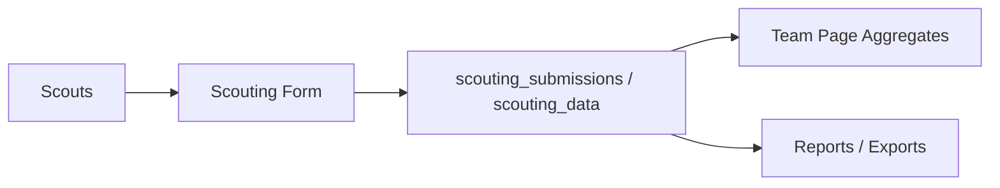

# Data Points for Scouting

## Scouting Form Inputs (Current)

Fields submitted by scouts in the current flow:

| Field | Notes |
|---|---|
| Event | Selected event ID |
| Team | Selected team ID |
| Alliance Color | red or blue |
| Starting Position | left, center, right |
| Defense Rating | qualitative rating |
| Traversal | selected traversal capability |
| Shooting Speed | qualitative speed |
| Capacity | qualitative capacity |
| Defendability | free-text notes |
| Teleop Strategy | scouting strategy descriptor |
| Hang Level | observed hang level |
| Auto Hang | observed auto hang behavior |
| Hang Position | observed hang position |
| Notes | qualitative notes (team-private display) |

## Synced Data Points (FIRST + TBA)

### FIRST sync

Used for event/team graph:

- Events
- Teams
- Event-team participation links
- Event metadata (including timezone when available)

### TBA sync

Used for stats and match schedule:

- OPR, DPR, CCWM
- Component OPRs
- Rankings and W-L-T
- Qual average and average match points
- Point fields (qual/elim/award/alliance/total)
- Match schedule and match results

## Team Page Aggregate Outputs

Derived from scouting submissions approved into `scouting_data`:

- Most common start position
- Most common defense rating
- Most common traversal
- Most common scoring strategy
- Most common hang level
- Most common auto hang
- Most common hang position
- Most common accuracy rating
- Alliance color distribution

## Privacy

Scouting notes are displayed with team-level privacy:

- Viewer sees notes submitted by their own team context
- Cross-team note visibility is intentionally blocked

## API Reference Notes

- FIRST Events API: source for event/team graph and initial participation context
- The Blue Alliance API: source for ranking/stat/match refresh loops

For detailed endpoint catalogs and payload examples, see:

- `FRC_API_Calls.md`
- `TBA_SCHEMA_FIX_SUMMARY.md`
