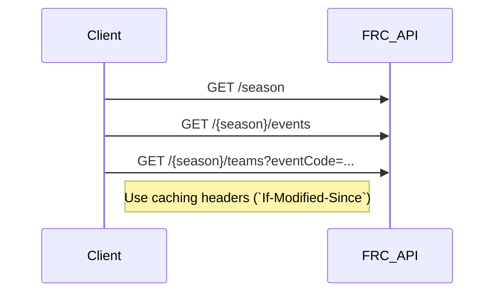

# FRC Events API Integration Guide



**Version:** 3.0  
**Base URL:** `https://frc-api.firstinspires.org/v3.0`  
**Authentication Required:** All endpoints  
**Token Request:** https://frc-events.firstinspires.org/services/API

---

## Authentication

All requests must include the following header:

```
Authorization: Basic <base64_encoded_token>
```

**Token Creation:**
1. Combine your username and authorization key with a colon: `username:authorizationKey`
2. Base64 encode the string: `echo -n "username:key" | base64`
3. Use the result in the Authorization header

Never commit real credentials to documentation, source, or logs.

---

## Request Headers

### Cache Control Headers
- **`If-Modified-Since`**: Returns 304 if no changes since provided date
- **`FMS-OnlyModifiedSince`**: Returns only modified records since provided date
- **`Accept`**: `application/json` or `application/xml`

### Response Headers
- **`Last-Modified`**: Timestamp of last data modification (save this for next request)
- **`Cache-Control`**: Caching guidance
- **`Content-Type`**: Response format

---

## Call Schedule Strategy

### 1. Initial Population (Run Once)
These calls populate your database with baseline data at the start of the season or when setting up the app.

### 2. Periodic Updates (Daily/Weekly)
These calls keep your data fresh when no active events are occurring.

### 3. Event Active (Every 5-15 minutes)
These calls run frequently during an active event you're scouting.

### 4. On-Demand (User Triggered)
These calls run when users select specific teams or matches.

---

## API Endpoints by Use Case

## 1. INITIAL POPULATION CALLS

### 1.1 Get Current Season
**Endpoint:** `GET /season`  
**Schedule:** Once at application start  
**Purpose:** Get the current FRC season year  

**Response:**
```json
{
  "seasonsFRC": 2026,
  "seasonsYear": 2026,
  "eventCount": 0,
  "gameName": "REEFSCAPE",
  "kickoffDate": "2026-01-04"
}
```

**Database Action:** Store current season year for all subsequent calls

---

### 1.2 List All Events for Season
**Endpoint:** `GET /{season}/events`  
**Schedule:** Once at season start, weekly during season  
**Parameters:**
- `{season}` - Year (e.g., 2026)

**Query Parameters (optional):**
- `eventCode` - Filter by specific event code
- `teamNumber` - Events a team is attending
- `districtCode` - Events in a specific district
- `excludeDistrict` - true/false

**Response:**
```json
{
  "Events": [
    {
      "eventCode": "MNDU",
      "name": "Minnesota North Star Regional",
      "type": "Regional",
      "districtCode": null,
      "venue": "Duluth Entertainment Convention Center",
      "city": "Duluth",
      "stateprov": "Minnesota",
      "country": "USA",
      "dateStart": "2026-03-05",
      "dateEnd": "2026-03-07",
      "address": "350 Harbor Dr, Duluth, MN 55802",
      "website": "http://northstarregional.org",
      "webcasts": [],
      "timezone": "America/Chicago"
    }
  ],
  "eventCount": 1
}
```

**Database Action:**
- Store all events with codes, names, dates, locations
- Create events table with fields: event_code, name, type, city, state, country, date_start, date_end, venue, timezone
- Use this for event selector dropdown in scouting forms

---

### 1.3 Get Teams at Specific Event
**Endpoint:** `GET /{season}/teams`  
**Schedule:** Once per event during pre-season, daily during event  
**Parameters:**
- `{season}` - Year (e.g., 2026)

**Query Parameters:**
- `eventCode` - Required to get teams at specific event
- `teamNumber` - Get specific team
- `districtCode` - Get teams in district
- `state` - Teams from specific state
- `page` - Page number for pagination

**Response:**
```json
{
  "teams": [
    {
      "teamNumber": 2220,
      "nameFull": "Blue Twilight",
      "nameShort": "Blue Twilight",
      "schoolName": "Heritage Christian Academy/etc",
      "city": "Maple Grove",
      "stateProv": "Minnesota",
      "country": "USA",
      "rookieYear": 2007,
      "robotName": "TBD",
      "districtCode": null,
      "website": "http://www.blueTwilightRobotics.org"
    }
  ],
  "teamCountTotal": 1,
  "teamCountPage": 1,
  "pageCurrent": 1,
  "pageTotal": 1
}
```

**Database Action:**
- Store teams attending each event in `event_teams` junction table
- Store team details in `teams` table: team_number, name_full, name_short, city, state, country, rookie_year
- Use for team selector dropdown in scouting forms

---

## 2. EVENT ACTIVE CALLS (During Competition)

### 2.1 Get Match Schedule
**Endpoint:** `GET /{season}/schedule/{eventCode}`  
**Schedule:** Every 15-30 minutes during event  
**Parameters:**
- `{season}` - Year (2026)
- `{eventCode}` - Event code (e.g., "MNDU")

**Query Parameters (optional):**
- `tournamentLevel` - qual, playoff
- `teamNumber` - Matches for specific team
- `matchNumber` - Specific match
- `start` - Start match number
- `end` - End match number

**Response:**
```json
{
  "Schedule": [
    {
      "description": "Qualification 1",
      "tournamentLevel": "Qualification",
      "matchNumber": 1,
      "startTime": "2026-03-05T09:00:00",
      "field": "Main",
      "teams": [
        {
          "teamNumber": 2220,
          "station": "Red1",
          "surrogate": false,
          "dq": false
        },
        {
          "teamNumber": 1816,
          "station": "Red2",
          "surrogate": false,
          "dq": false
        },
        {
          "teamNumber": 4181,
          "station": "Red3",
          "surrogate": false,
          "dq": false
        },
        {
          "teamNumber": 2220,
          "station": "Blue1",
          "surrogate": false,
          "dq": false
        },
        {
          "teamNumber": 5837,
          "station": "Blue2",
          "surrogate": false,
          "dq": false
        },
        {
          "teamNumber": 3130,
          "station": "Blue3",
          "surrogate": false,
          "dq": false
        }
      ]
    }
  ]
}
```

**Database Action:**
- Store/update match schedule in `matches` table
- Store team assignments in `match_teams` table
- Display upcoming matches for scouting assignment
- Use to validate match data entry (ensure team was actually in that match)

---

### 2.2 Get Match Results
**Endpoint:** `GET /{season}/matches/{eventCode}`  
**Schedule:** Every 5-10 minutes during active event  
**Parameters:**
- `{season}` - Year (2026)
- `{eventCode}` - Event code

**Query Parameters (optional):**
- `tournamentLevel` - qual, playoff
- `teamNumber` - Matches for specific team
- `matchNumber` - Specific match
- `start`, `end` - Match range

**Response:**
```json
{
  "Matches": [
    {
      "description": "Qualification 1",
      "tournamentLevel": "Qualification",
      "matchNumber": 1,
      "startTime": "2026-03-05T09:00:00",
      "actualStartTime": "2026-03-05T09:02:34",
      "postResultTime": "2026-03-05T09:05:12",
      "scoreRedFinal": 124,
      "scoreRedFoul": 10,
      "scoreRedAuto": 35,
      "scoreBlueFinal": 98,
      "scoreBlueFoul": 0,
      "scoreBlueAuto": 28,
      "teams": [
        {
          "teamNumber": 2220,
          "station": "Red1",
          "dq": false
        }
      ]
    }
  ]
}
```

**Database Action:**
- Update matches with scores and actual times
- Use for displaying completed match data
- Cross-reference with scouting submissions
- Calculate team statistics

---

### 2.3 Get Score Details (Detailed Breakdown)
**Endpoint:** `GET /{season}/scores/{eventCode}/{tournamentLevel}`  
**Schedule:** Every 10-15 minutes during event  
**Parameters:**
- `{season}` - Year (2026)
- `{eventCode}` - Event code
- `{tournamentLevel}` - "qual" or "playoff"

**Query Parameters (optional):**
- `teamNumber` - Scores for specific team
- `matchNumber` - Specific match
- `start`, `end` - Match range

**Response (2026 REEFSCAPE Specific):**
```json
{
  "MatchScores": [
    {
      "matchLevel": "Qualification",
      "matchNumber": 1,
      "Alliances": [
        {
          "alliance": "Red",
          "totalPoints": 124,
          "autoPoints": 35,
          "teleopPoints": 79,
          "endgamePoints": 10,
          "foulPoints": 0,
          "adjustPoints": 0,
          "rp": 2,
          "autoTowerRobot1": "Level2",
          "autoTowerRobot2": "Level1",
          "autoTowerRobot3": "None",
          "autoTowerPoints": 35,
          "endGameTowerRobot1": "Level3",
          "endGameTowerRobot2": "Level2",
          "endGameTowerRobot3": "Level1",
          "endGameTowerPoints": 10,
          "hubScore": {
            "autoCount": 5,
            "autoPoints": 20,
            "teleopCount": 12,
            "teleopPoints": 48,
            "endgameCount": 2,
            "endgamePoints": 8,
            "shift1Count": 3,
            "shift1Points": 12,
            "totalCount": 22,
            "totalPoints": 88
          },
          "energizedAchieved": true,
          "superchargedAchieved": false,
          "traversalAchieved": true,
          "minorFoulCount": 0,
          "majorFoulCount": 0
        },
        {
          "alliance": "Blue",
          "totalPoints": 98
        }
      ]
    }
  ]
}
```

**Database Action:**
- Store detailed scoring breakdown per match/alliance
- Use for advanced analytics and OPR calculations
- Display in match detail views
- Analyze specific game element performance

---

### 2.4 Get Event Rankings
**Endpoint:** `GET /{season}/rankings/{eventCode}`  
**Schedule:** Every 10-15 minutes during event  
**Parameters:**
- `{season}` - Year (2026)
- `{eventCode}` - Event code

**Query Parameters (optional):**
- `teamNumber` - Get specific team's ranking
- `top` - Get top N teams

**Response:**
```json
{
  "Rankings": [
    {
      "rank": 1,
      "teamNumber": 2220,
      "sortOrder1": 2.45,
      "sortOrder2": 145.2,
      "sortOrder3": 98.3,
      "sortOrder4": 47.8,
      "sortOrder5": 15,
      "sortOrder6": 0,
      "wins": 8,
      "losses": 2,
      "ties": 0,
      "qualAverage": 145.2,
      "dq": 0,
      "matchesPlayed": 10
    }
  ]
}
```

**Database Action:**
- Store current rankings
- Display on dashboard
- Use for strategic alliance selection planning
- Track ranking point accumulation

---

### 2.5 Get Alliance Selections
**Endpoint:** `GET /{season}/alliances/{eventCode}`  
**Schedule:** Once after alliance selection, then as needed  
**Parameters:**
- `{season}` - Year (2026)
- `{eventCode}` - Event code

**Response:**
```json
{
  "Alliances": [
    {
      "number": 1,
      "captain": 2220,
      "round1": 1816,
      "round2": 4181,
      "round3": null,
      "backup": null,
      "backupReplaced": null
    }
  ],
  "count": 8
}
```

**Database Action:**
- Store alliance selections
- Display playoff bracket
- Track backup team usage

---

### 2.6 Get Awards
**Endpoint:** `GET /{season}/awards/{eventCode}`  
**Schedule:** End of event or daily  
**Parameters:**
- `{season}` - Year (2026)
- `{eventCode}` - Event code

**Query Parameters (optional):**
- `teamNumber` - Awards for specific team

**Response:**
```json
{
  "Awards": [
    {
      "awardId": 1,
      "teamNumber": 2220,
      "awardName": "Regional Winner",
      "series": 0,
      "person": null
    }
  ],
  "awardCount": 1
}
```

**Database Action:**
- Store awards won by teams
- Display team achievements

---

## 3. PERIODIC UPDATE CALLS

### 3.1 Get District Listings
**Endpoint:** `GET /{season}/districts`  
**Schedule:** Once per season  
**Parameters:**
- `{season}` - Year (2026)

**Response:**
```json
{
  "districts": [
    {
      "code": "FIM",
      "name": "FIRST In Michigan"
    }
  ],
  "districtCount": 1
}
```

**Database Action:**
- Store district codes and names
- Use for filtering events and teams

---

### 3.2 Get All Teams (Full List)
**Endpoint:** `GET /{season}/teams`  
**Schedule:** Once per season, or when needed  
**Parameters:**
- `{season}` - Year (2026)

**Query Parameters:**
- `page` - Page number (pagination required for full list)

**Response:** Same as 1.3 (Get Teams at Event)

**Database Action:**
- Populate full teams database
- Use for team lookup and autocomplete

---

## 4. UTILITY/ANCILLARY CALLS

### 4.1 Get Event List By Type
**Endpoint:** `GET /{season}/events`  
**Query Parameters:**
- `eventCode` - Specific event
- `teamNumber` - Events team is attending
- `districtCode` - District events only
- `excludeDistrict` - Exclude district events

Use to populate event selectors with filtered lists.

---

### 4.2 Avatar/Logo Endpoints
**Endpoint:** `GET /{season}/avatars`  
**Purpose:** Get team avatar images

Team avatars can be displayed in the UI using:
```
https://frc-api.firstinspires.org/{season}/avatars/{teamNumber}?size=small
```

Sizes: `small`, `medium`, `large`

---

## IMPLEMENTATION NOTES

### Caching Strategy

```go
type APICache struct {
    LastModified string
    Data         interface{}
    Endpoint     string
}

// On first request
resp := makeRequest(endpoint)
cache := APICache{
    LastModified: resp.Header.Get("Last-Modified"),
    Data:         resp.Body,
    Endpoint:     endpoint,
}
saveCache(cache)

// On subsequent requests
req.Header.Set("If-Modified-Since", cache.LastModified)
resp := makeRequest(endpoint)
if resp.StatusCode == 304 {
    // Use cached data
    return cache.Data
}
// Update cache with new data
```

---

## COMPLEMENTARY: Blue Alliance API

Your DataPoints.md references The Blue Alliance API which provides additional analytics. Consider using **both APIs**:

- **FRC Events API**: Official real-time match data
- **Blue Alliance API**: OPR, DPR, CCWM, predictions, historical data

The Blue Alliance API is documented at: https://www.thebluealliance.com/apidocs/v3

---

## TESTING

### Test with Season 2024 Data
Use 2024 data for testing (complete season):
```
GET https://frc-api.firstinspires.org/v3.0/2024/events
GET https://frc-api.firstinspires.org/v3.0/2024/matches/MNDU
```

### Mock Event Code
Some events for testing:
- `MNDU` - Minnesota North Star Regional
- `CAOC` - Orange County Regional
- `MIWMI` - West Michigan District Event

---

## SUPPORT & RESOURCES

- **API Token Request**: https://frc-events.firstinspires.org/services/API
- **Documentation**: https://frc-api-docs.firstinspires.org/
- **FMS Forum**: FIRST Tech Challenge TeamForge site
- **Status Page**: Check for API availability issues

## SUMMARY: MINIMUM VIABLE CALLS

For a basic scouting app, you **must** implement:

1. ✅ `GET /season` - Current season
2. ✅ `GET /{season}/events` - Event list
3. ✅ `GET /{season}/teams?eventCode={code}` - Teams at event
4. ✅ `GET /{season}/schedule/{eventCode}` - Match schedule
5. ✅ `GET /{season}/matches/{eventCode}` - Match results

**Nice to have:**
- `GET /{season}/rankings/{eventCode}` - Rankings
- `GET /{season}/scores/{eventCode}/qual` - Detailed scores
- `GET /{season}/alliances/{eventCode}` - Alliance selections
