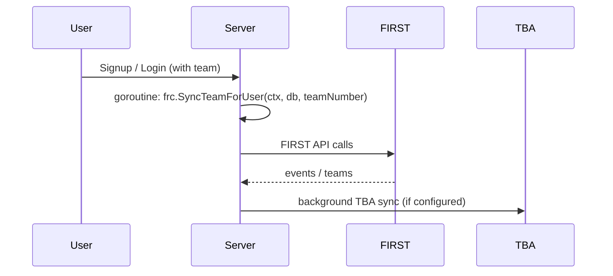

# Team Data Sync on Signup and Login

## Overview

When a user has a team number, auth flows can trigger team-scoped data sync so pages are quickly populated for that team context.

Synced data includes:

- FIRST event and team attendance data
- Team/event relationships
- Background TBA stats sync for events the team attends (when TBA key is configured)

## Trigger Points

### Signup path

- `internal/handlers/auth.go` launches `frc.SyncTeamForUser(...)` in a goroutine when a valid team number is present.

### Login path

- `internal/handlers/auth.go` can launch the same team sync to refresh data for returning users.

## Core Function

### `frc.SyncTeamForUser(ctx, db, teamNumber)`

Location: `internal/frc/sync.go`

Behavior:

1. Validates FIRST credentials from env.
2. Resolves season (default `2026`, overridable by `FIRST_SEASON`).
3. Fetches events for the specified team from FIRST API.
4. Upserts `events`, `teams`, and `event_teams`.
5. Starts asynchronous TBA sync for those events if `TBA_AUTH_KEY` is set.

Return value:

- `SyncResult` with counts for events, teams, and event-team links.

## Background TBA Follow-up

### `syncTeamTBAStatsForUser(db, teamID, eventIDs)`

Location: `internal/frc/sync.go`

- Runs in a separate goroutine.
- Uses background context to avoid cancellation after HTTP response returns.
- Skips work if `TBA_AUTH_KEY` is empty.
- For each event, fetches and upserts TBA-derived team stats and rankings.

## Required Environment

FIRST sync requires:

- `FIRST_API_USERNAME`
- `FIRST_API_KEY`

Optional but useful:

- `FIRST_SEASON`
- `TBA_AUTH_KEY` (enables TBA metrics phase)

## Data Impact

Tables touched during auth-triggered sync:

- `events`
- `teams`
- `event_teams`
- `team_event_stats` (when TBA phase runs)

## Error Handling

- Missing FIRST credentials: sync is skipped cleanly.
- Team with no events: returns successful result with zero counts.
- Partial event failures: logs warnings and continues remaining events.
- Missing TBA key: FIRST sync still completes.

## Operational Guidance

- Keep FIRST credentials configured in all environments where signup/login team sync is expected.
- Keep `TBA_AUTH_KEY` configured to avoid empty stats views right after team onboarding.
- Use `POST /api/frc/sync` for admin/lead-scout manual refresh if data appears stale.
