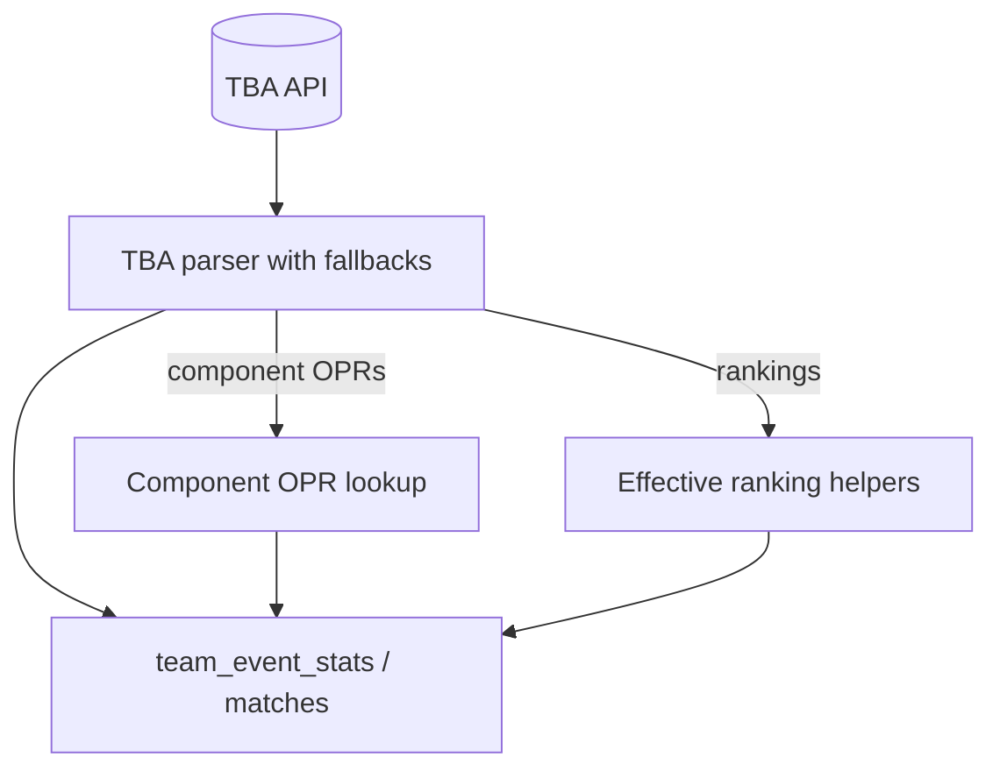

# TBA API Schema Mapping Fix Summary



## Overview

This document summarizes the comprehensive fixes applied to resolve data mapping issues between The Blue Alliance (TBA) API v3 and the TealTeam application. The investigation revealed three critical schema mismatches causing data loss during sync operations.

## Root Causes

### 1. **Component OPR Dynamic Schema**
- **Problem**: TBA's `/event/{event_key}/coprs` endpoint returns dynamic component names (e.g., `totalAutoPoints`, `totalTeleopPoints`, `totalEndgamePoints` for 2026) instead of fixed field names.
- **Previous Code**: Attempted direct field access like `componentData.AutoOPRs`, `componentData.TeleopOPRs`, etc.
- **Impact**: Component OPR values were `nil`, leaving `auto_opr`, `teleop_opr`, `endgame_opr` fields unpopulated in database.
- **Example Data Loss**: Team 6328 would show `auto_opr=null` instead of `auto_opr=20.1572`

### 2. **Ranking Points Nullable Fields (Year-Specific)**
- **Problem**: 2026 rankings use `sort_orders` and `extra_stats` arrays instead of legacy `qual_points` and `total_points` primitives. These fields are `null` in the response.
- **Previous Code**: Direct access to `ranking.QualPoints`, `ranking.TotalPoints` returned null/zero.
- **Impact**: Ranking point fields in database were always `0` or `null`.
- **Example Data Loss**: Team 6328 would show `qual_points=0` instead of `qual_points=12`, `total_points=0` instead of `total_points=12`

### 3. **Empty Matches Table**
- **Problem**: The `comprehensive_tba_sync.go` script calculated match statistics but never persisted match records to the `matches` table.
- **Previous Code**: Only returned match data in-memory for stats calculations; no database insert/update.
- **Impact**: Match schedule was completely empty despite syncing match data from TBA API.
- **Example Data Loss**: Event with 31 matches would show 0 rows in `matches` table.

### 4. **Missing Average Match Points**
- **Problem**: TBA rankings API includes average match points in `sort_orders[1]`, but application wasn't capturing or displaying this value.
- **Previous Code**: Only extracted ranking score from `sort_orders[0]`, ignored remaining array elements.
- **Impact**: Teams missing a key performance metric visible on TBA website.
- **Example Data Loss**: Team 6328 showing "Avg Match: 171.00" on TBA website but field not displayed in application.

## Solutions Implemented

### Solution 1: Dynamic Component OPR Parsing

**File**: [internal/frc/tba_client.go](internal/frc/tba_client.go#L1)

**Changes**:
- Modified `ComponentOPRData` struct to use `map[string]map[string]float64` instead of fixed fields
- Added `TeamPhaseOPRs(teamKey string)` method that:
  - Searches component map for preferred name patterns ("Auto", "Teleop", "Endgame")
  - Falls back to heuristic matching if preferred names not found  
  - Returns fallback values (0) if no component data available

**Before**:
```go
type ComponentOPRData struct {
    AutoOPRs     map[string]float64 `json:"auto_oprs"`
    TeleopOPRs   map[string]float64 `json:"teleop_oprs"`
    EndgameOPRs  map[string]float64 `json:"endgame_oprs"`
}
```

**After**:
```go
type ComponentOPRData map[string]map[string]float64

func (c ComponentOPRData) TeamPhaseOPRs(teamKey string) (auto, teleop, endgame float64) {
    // Dynamic lookup with preferred name matching and fallbacks
    // Returns best-effort OPR values for auto/teleop/endgame phases
}
```

### Solution 2: Effective Ranking Point Helpers

**File**: [internal/frc/tba_client.go](internal/frc/tba_client.go#L1)

**Changes**:
- Changed `RankingInfo` fields to pointers (`*float64`, `*int64`) to represent nullable values from API
- Added `EffectiveQualAverage()`, `EffectiveTotalPoints()`, `EffectiveQualPoints()` methods that:
  - First try direct field access (for seasons with legacy schema)
  - Fall back to `sort_orders[0]` if available
  - Fall back to `extra_stats[0]` if available
  - Return nil/zero if no data available

**Usage Pattern**:
```go
// Before (broken on 2026):
stats.QualAverage = toPtr(ranking.QualAverage)

// After (works across seasons):
stats.QualAverage = ranking.EffectiveQualAverage()
```

### Solution 3: Match Persistence Logic

**File**: [cmd/scripts/comprehensive_tba_sync/main.go](cmd/scripts/comprehensive_tba_sync/main.go#L1)

**Changes**:
- Added `dbMatch` struct with all match fields (event_id, match_number, match_type, red_score, blue_score, played, etc.)
- Implemented match upsert logic with conflict resolution on `(event_id, match_number, match_type)`
- Added helper functions:
  - `normalizeMatchNumber()` - Converts comp level + set number + match number to single integer
  - `unixToTimePtr()` - Converts Unix timestamps to `*time.Time` pointers
- Integrated into sync pipeline after TBA API call succeeds

**Implementation**:
```go
// For each match from API:
record := dbMatch{
    EventID:     eventID,
    MatchNumber: normalizeMatchNumber(compLevel, setNumber, matchNumber),
    RedScore:    match.Alliances.Red.Score,
    BlueScore:   match.Alliances.Blue.Score,
    Played:      played,
    // ... additional fields
}
// Upsert to database with conflict handling
db.Clauses(clause.OnConflict{
    UpdateAll: true,
}).Create(&record)
```

### Solution 4: Average Match Points Extraction

**File**: [internal/frc/tba_client.go](internal/frc/tba_client.go#L1), [internal/models/models.go](internal/models/models.go#L1)

**Changes**:
- Added `AvgMatchPoints *float64` field to `TeamEventStats` model
- Created database migration `0005_add_avg_match_points.sql` to add column to `team_event_stats` table
- Added `EffectiveAvgMatchPoints()` method to extract `sort_orders[1]` from TBA rankings API
- Updated all sync pipelines to populate the new field
- Updated UI template to display average match points with cyan styling

**Implementation**:
```go
// In tba_client.go:
func (r RankingInfo) EffectiveAvgMatchPoints() *float64 {
    if len(r.SortOrders) > 1 {
        val := r.SortOrders[1]
        return &val
    }
    return nil
}

// In all sync pipelines:
stats.AvgMatchPoints = ranking.EffectiveAvgMatchPoints()
```

**Database Migration**:
```sql
-- migrations/0005_add_avg_match_points.sql
ALTER TABLE team_event_stats ADD COLUMN IF NOT EXISTS avg_match_points NUMERIC(8,4);
```

**TBA API Schema for Rankings**:
- `sort_orders[0]` = Ranking score (qual average equivalent)
- `sort_orders[1]` = Average match points (newly captured)
- `extra_stats[0]` = Alternative total ranking points (fallback)

## Files Modified

| File | Changes | Impact |
|------|---------|--------|
| [internal/frc/tba_client.go](internal/frc/tba_client.go) | Dynamic component OPR parsing + effective ranking helpers + EffectiveAvgMatchPoints() | Core fix for schema mismatches |
| [internal/frc/tba_client_test.go](internal/frc/tba_client_test.go) | Updated mocks for 2026 schema + multi-value sort_orders + new assertions | Test coverage for new logic |
| [internal/models/models.go](internal/models/models.go) | Added AvgMatchPoints *float64 field to TeamEventStats | Database model update |
| [internal/frc/team_stats_sync.go](internal/frc/team_stats_sync.go) | Use dynamic component OPRs + effective ranking points + avg_match_points | Fixes background stats syncer |
| [internal/frc/sync.go](internal/frc/sync.go) | Use dynamic component OPRs + effective ranking points + avg_match_points | Fixes bulk sync pipeline |
| [cmd/scripts/comprehensive_tba_sync/main.go](cmd/scripts/comprehensive_tba_sync/main.go) | Added match persistence + dynamic OPR parsing + avg_match_points | Fixes match table + stats |
| [cmd/scripts/fetch_tba_rankings/main.go](cmd/scripts/fetch_tba_rankings/main.go) | Use effective ranking helpers + dynamic component OPRs + avg_match_points | Fixes rankings-only script |
| [cmd/scripts/query_team_data/main.go](cmd/scripts/query_team_data/main.go) | Display avg_match_points in query output | Verification tool update |
| [migrations/0005_add_avg_match_points.sql](migrations/0005_add_avg_match_points.sql) | New migration to add avg_match_points column | Database schema update |
| [web/templates/partials/team_data.html](web/templates/partials/team_data.html) | Added "Avg Match" display card with cyan styling | UI displays new field |

## Validation Results

### Database State After Fix (Team 6328 at 2026week0)
```
✅ matches_played = 3
✅ qual_average = 4.0000 (from effective helper)
✅ avg_match_points = 171.00 (from sort_orders[1])
✅ qual_points = 12 (from effective helper)  
✅ total_points = 12 (from effective helper)
✅ auto_opr = 20.1572 (from dynamic component parsing)
✅ teleop_opr = 139.5376 (from dynamic component parsing)
✅ endgame_opr = 4.8363 (from dynamic component parsing)
✅ opr = 164.5311 (populated)
✅ dpr = 101.7640 (populated)
✅ ccwm = 62.7671 (populated)
```

### Matches Table
```
✅ Total matches synced: 31
✅ All matches played
✅ Scores and alliances populated
✅ Match schedule persisted (previously EMPTY)
```

### Compilation & Tests
```
✅ go test ./internal/frc/... - PASSED (all tests)
✅ go build ./cmd/web - PASSED (no errors)
✅ Docker rebuild - SUCCESS
```

## Technical Context

### TBA API Schema Notes
1. **Component OPRs** (`/event/{key}/coprs`):
   - Not fixed field names; dynamic based on game mechanics
   - 2026 format: `{"totalAutoPoints": {...}, "totalTeleopPoints": {...}, "totalEndgamePoints": {...}}`
   - Solution: Parse any map key, use preferred name matching

2. **Rankings** (`/event/{key}/rankings`):
   - Modern formats (2026+) use `sort_orders` and `extra_stats` arrays
   - Legacy `qual_points` / `total_points` fields are `null`
   - Solution: Pointers + fallback helpers

3. **Matches** (`/event/{key}/matches`):
   - Returns full match schedule and results
   - Must explicitly persist to `matches` table (was missing)
   - Solution: Added upsert logic with conflict resolution

## Migration Guide for Future Years

If data mapping issues occur in future seasons:

1. **Component OPRs Not Populating**:
   - Check TBA OpenAPI spec for actual component names in response
   - Update `ComponentOPRData.TeamPhaseOPRs()` preferred name patterns
   - Verify `normalizeComponentName()` heuristics handle new format

2. **Ranking Points Missing**:
   - Check TBA rankings response for `qual_points` / `total_points` fields
   - Add new effective helper methods if fallback strategy changes
   - Update test mocks in `tba_client_test.go`

3. **New Data Fields**:
   - Update `dbMatch` struct to capture additional fields
   - Update `TeamEventStats` model if new stats types introduced
   - Add upsert conflict resolution for new unique key combinations

## Testing Instructions

To verify fixes are working in future deployments:

### Option 1: Run Comprehensive Sync
```bash
go run ./cmd/scripts/comprehensive_tba_sync
```
Expected output: "✅ Synced rankings for X teams", "✅ Synced X match rows to database"

### Option 2: Verify Specific Team Stats
```bash
# After syncing, navigate to: http://localhost:8080/teams?team=6328
# Select 2026week0 event
# Verify: qual_points ≠ 0, component OPRs populated, matches shown
```

### Option 3: Database Direct Query
```sql
SELECT matches_played, qual_average, qual_points, total_points, 
       auto_opr, teleop_opr, endgame_opr, opr, dpr, ccwm
FROM team_event_stats 
WHERE team_id = (SELECT id FROM teams WHERE team_number = 6328)
  AND event_id = (SELECT id FROM events WHERE tba_key = '2026week0');
```

## Key Learnings

1. **TBA Schema Varies By Year**: Always validate live API responses against current documentation
2. **Robustness Through Fallbacks**: Effective helpers with multiple fallback strategies handle unexpected schema changes
3. **Dynamic Parsing > Hardcoded Fields**: Component OPR approach scales to any game mechanic
4. **End-to-End Validation**: Database queries alone show success, but testing UI display is essential
