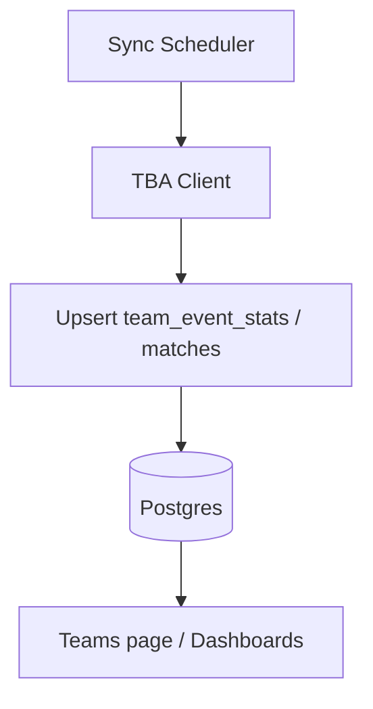

# Team Statistics Syncing

## Overview

TealTeam runs a background sync service that keeps `team_event_stats` and `matches` updated from The Blue Alliance (TBA) for active and nearby events.

Data synced includes:

- OPR, DPR, CCWM
- Component OPRs (auto, teleop, endgame)
- Ranking and W-L-T record fields
- District-style point fields when present
- Match schedule and played results

## Components

### `internal/frc/tba_client.go`

- Handles authenticated requests with `X-TBA-Auth-Key`.
- Fetches event OPR payloads, component OPR payloads, rankings, and matches.
- Applies fallback parsing for season schema differences.

### `internal/frc/team_stats_sync.go`

- Implements `TeamStatsSyncer` background loop.
- Chooses sync interval by event timing.
- Upserts `team_event_stats` and `matches` for each relevant event.

## Startup Behavior

At app boot (`cmd/web/main.go`):

1. `LoadSyncConfig()` reads `TBA_AUTH_KEY`.
2. If key is empty, syncer is not started.
3. If key is set, `NewTeamStatsSyncer(...).Start()` runs in background.

## Sync Cadence

The sync loop uses:

- 2 minutes when events are active now
- 3 hours between active windows

When no active events are found, it scans a near-term window for recent/upcoming events.

## Data Writes

### `team_event_stats`

Upsert key: `(team_id, event_id)`

Updated fields include:

- OPR fields
- Rank and record
- Qual average / average match points
- Points fields
- `updated_at`

### `matches`

Upsert key: `(event_id, match_number, match_type)`

Updated fields include:

- Score and played status
- TBA metadata (`tba_key`, `comp_level`, `set_number`)
- `scheduled_time`, `actual_time`, `winning_alliance`
- `updated_at`

## Configuration

Required for TBA sync:

- `TBA_AUTH_KEY`

Related env used by event key handling:

- `FIRST_SEASON` (defaults to `2026` if unset)

## Error Handling

- Missing `TBA_AUTH_KEY`: sync disabled, app still serves pages.
- Per-event failures are logged and do not stop whole loop.
- Missing/invalid event TBA key: event skipped.
- Sync continues on next cycle.

## Observability

Look for logs such as:

- `Team stats sync loop started`
- `Synced team stats for ... teams at event ...`
- `Synced ... matches for event ...`
- warnings for fetch or upsert failures

## Manual FIRST Sync (Related)

`POST /api/frc/sync` triggers FIRST event/team sync (not TBA stats directly). It is restricted to authenticated admin or lead scout users.

## Troubleshooting

### Stats not updating

- Verify `TBA_AUTH_KEY` is set and valid.
- Confirm events have a non-empty `tba_key` in DB.
- Check logs for API or parsing warnings.

### Match schedule missing

- Confirm event has valid TBA key.
- Verify sync loop is running.
- Check `matches` rows for event in DB.
